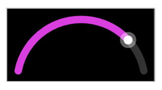
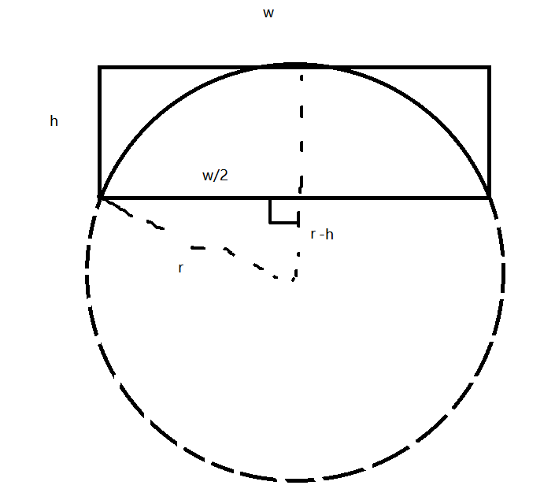

# Android 弧形进度条
给定宽高，绘制出一个宽高范围内的最大正圆弧

宽高比需要>=2，等于2时最大正圆弧是半圆

可以根据需要设置弧形的背景色，进度色，滑块，滑块边框，弧形的宽度，滑块的半径等。

原理
r² = (w/2)² + (r-h)²

r² = w²/4 + h² + r² - 2rh

2rh = w²/4 + h²

r = (w²/4 + h²)/2h = w²/8h + h/2  = (w²+4h²)/8h
